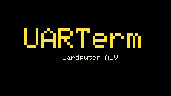
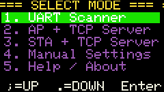

# UARTerm

A feature-packed UART serial terminal and TCP server monitor for **M5Cardputer ADV** (ESP32-S3, 8MB flash, OPI PSRAM).

Automatically detects UART pinout (G1/G2), baud rate, and data — designed for **NMEA** (GPS) debugging but works with any serial protocol.


<p align="center">
  
  
</p>

## Features

### UART Scanner
- **Auto pin detection** — listens on G1 and G2 for falling edges, picks the RX pin
- **Auto baud scan** — scans 12 rates (300–921600), scores bytes NMEA-style (`$` = 5, ASCII = 1)
- **Manual override** — `;` / `.` to step baud up/down, `/` to swap RX/TX pins, `R` to rescan
- **HEX mode** — `H` toggles hex dump (13 bytes per line)
- **Clear screen** — `C`

### WiFi TCP Server
- **AP Mode** — device creates its own WiFi network, TCP server on port 8888 (default)
- **STA Mode** — connects to your WiFi network, TCP server on port 8888
- **WiFi scan** — scans all available networks, shows signal strength (`###`), known networks highlighted in **green**
- **KnownNetworks** — saves successfully connected STA credentials to `/uarterm/known.cfg` (up to 16). Auto-connect on Enter, no password re-entry
- **Multiple clients** — up to 8 simultaneous TCP connections
- **Bottom info bar** — shows mode (AP/STA), SSID, IP address, port, client count

### Display & UI
- **240×135 TFT** with scrolling terminal view, top status bar, bottom info bar
- **Boot menu** — select mode, configure settings, WiFi scan, help
- **Top bar** — shows TX/RX pins, baud rate, LOG indicator (blinking orange dot when SD logging active), activity LED
- **Bottom bar** — network info (mode + SSID + IP:port + clients) only in network modes, auto-cleared in scanner mode
- **On-screen keyboard** — all controls via built-in QWERTY keyboard
- **Screenshot** — `P` saves screen capture as 16-bit BMP to `/uarterm/SCR_xxx.bmp`. Works in all modes including splash screen

### SD Card Logging
- `S` toggles logging to `/uarterm/` on microSD
- Auto-numbered files per session (e.g., `LOG_001.bin`)
- Buffered write for performance
- Works in all modes (scanner, AP, STA)

### Settings (persistent on SD)
- Stored in `/uarterm/settings.cfg`
- Baud rate, RX/TX pin assignment, AP SSID/password, STA SSID/password, TCP port, SD logging toggle
- Editable from the boot menu ("4. Manual Settings")
- Loaded on boot, auto-saved when changed

## Controls

### Boot Menu
| Key | Action |
|-----|--------|
| `;` | Up / Previous |
| `.` | Down / Next |
| `Enter` | Select / Confirm |
| `Del` | Back / Exit |
| `C` | Cancel / Return to menu |
| `P` | Screenshot |

### Monitor Mode (Scanner / AP / STA)
| Key | Action |
|-----|--------|
| `;` | Baud rate up |
| `.` | Baud rate down |
| `/` | Swap RX/TX pins |
| `R` | Rescan / restore auto baud |
| `H` | Toggle HEX dump mode |
| `C` | Clear terminal screen |
| `S` | Toggle SD card logging |
| `Del` | Exit to boot menu |
| `P` | Screenshot |

### WiFi Scan
| Key | Action |
|-----|--------|
| `;` / `.` | Navigate networks |
| `Enter` | Select (known = connect, unknown = enter password) |
| `C` | Cancel / Back to menu |
| `Del` | Back to menu |

## Hardware

- **M5Cardputer ADV** (ESP32-S3, 8MB flash, 240×135 TFT, QWERTY keyboard, microSD, USB-C)
- UART on **G1** (pin 1) and **G2** (pin 2) — 3.3V logic level
- Requires **OPI PSRAM** enabled for stable operation

## Installation

### Method 1: Arduino CLI (recommended)

```bash
# Install ESP32 platform
arduino-cli core update-index
arduino-cli core install esp32:esp32

# Install M5Cardputer library
arduino-cli lib install M5Cardputer

# Compile with 8MB flash + OPI PSRAM
arduino-cli compile --fqbn esp32:esp32:m5stack_cardputer:FlashSize=8M,PartitionScheme=default_8MB,PSRAM=opi .

# Upload via USB
arduino-cli upload --fqbn esp32:esp32:m5stack_cardputer:FlashSize=8M,PartitionScheme=default_8MB,PSRAM=opi --port /dev/ttyACM0 .
```

### Method 2: Arduino IDE
1. Install **ESP32** board support (Board Manager URL: `https://espressif.github.io/arduino-esp32/package_esp32_index.json`)
2. Install **M5Cardputer** library (Library Manager)
3. Set board to **M5Stack Cardputer**
4. **Board Settings**:
   - Flash Size: **8MB (64Mb)**
   - Partition Scheme: **8M with spiffs (3MB APP/1.5MB SPIFFS)**
   - PSRAM: **OPI PSRAM**
5. Open `uarterm.ino`, compile and upload

### Method 3: LAUNCHER (SD card OTA)

Copy `UARTerm_v1.0_8MB_app.bin` to your SD card and flash via M5Cardputer LAUNCHER:

```
SD:/UARTerm_v1.0_8MB_app.bin
```

The app-only binary writes to the OTA partition — no bootloader/partition table overwritten.

## Releases

Pre-built binaries for each release:

| File | Size | Description |
|------|------|-------------|
| `UARTerm_v1.0_8MB_app.bin` | ~1.2 MB | **App-only** — for LAUNCHER OTA or flashing at 0x10000 |
| `UARTerm_v1.0_8MB_merged.bin` | 8 MB | **Full flash** — bootloader + partitions + app, for USB flashing at 0x0 |

Build configuration: `FlashSize=8M,PartitionScheme=default_8MB,PSRAM=opi`

## Project Structure

```
uarterm/
  uarterm.ino            — Main entry, splash, mode switching, screenshot
  BootMenu.h/.cpp         — Boot menu, settings editor, WiFi scan, known networks
  DisplayManager.h/.cpp   — 240×135 TFT rendering, top/bottom bars, sprite capture
  NetManager.h/.cpp       — WiFi AP/STA, TCP server, broadcast, client management
  UartScanner.h/.cpp      — Auto pin/baud detection, NMEA scoring, manual override
  SDLogger.h/.cpp         — Buffered SD card file logging
  SettingsManager.h/.cpp  — Settings read/write from SD (/uarterm/settings.cfg)
  KnownNetworks.h/.cpp    — Known WiFi networks (/uarterm/known.cfg)
  AppConfig.h             — AppSettings struct
```

## SD Card Layout

```
SD:/
  uarterm/
    settings.cfg           — Persistent configuration
    known.cfg              — Known WiFi networks (auto-saved)
    SCR_001.bmp ..         — Screenshots (P key)
    LOG_001.bin ..          — SD card logs (S key)
```

## Why

I needed a proper UART terminal for the M5Cardputer. Existing firmware was either too basic, too buggy, or missing essential features like auto-baud, TCP streaming, or SD logging. So I wrote one.

## License

MIT
